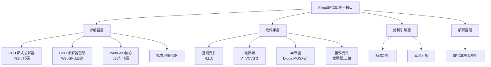

# 🎯 AkingSPICE 專業級專案管理總覽

## 📊 專案現況分析

基於對 `src` 目錄的深入分析，AkingSPICE 是一個具有企業級複雜度的電路模擬器項目：

### 🏗️ 技術架構特點



### 📈 專案複雜度指標

| 項目 | 數量 | 複雜度 |
|------|------|--------|
| **核心求解器** | 3個主要類 | ⭐⭐⭐⭐⭐ |
| **電路元件** | 11個元件類 | ⭐⭐⭐⭐ |
| **測試覆蓋** | 54個測試檔案 | ⭐⭐⭐⭐⭐ |
| **代碼行數** | >2000行核心代碼 | ⭐⭐⭐⭐⭐ |
| **技術棧** | WebGPU + ES6 + WGSL | ⭐⭐⭐⭐⭐ |

---

## 🎯 專項管理策略

### 1. 🔥 核心求解器管理

**最高優先級模組** - 影響整個專案穩定性

#### 管理分類：
- **CPU求解器** (`explicit-state-solver.js`)
  - 791行複雜代碼
  - 數值穩定性挑戰
  - 顯式方法固有限制

- **GPU求解器** (`gpu-explicit-solver.js` + `webgpu-solver.js`)
  - 雙層架構設計
  - WebGPU環境依賴
  - 4.6x性能提升潛力

#### 測試策略：
```bash
# 核心求解器專項測試
npm run test:core-solvers

# 數值穩定性深度測試
npm run test:stability

# CPU-GPU一致性驗證
npm run test:consistency
```

### 2. ⚡ 雙模式開發管理

**並行開發挑戰** - CPU/GPU求解器需要保持結果一致性

#### 開發規則：
1. **修改CPU求解器** → 必須確保GPU求解器相容
2. **GPU性能優化** → 不可犧牲數值精確度
3. **新元件添加** → 雙求解器都需支援

#### 驗證流程：


### 3. 🧪 測試系統管理

**54個現有測試** + **新分層測試框架**

#### 測試分層策略：

```
測試金字塔:
├── 🔴 核心求解器測試 (最嚴格)
│   ├── 數值穩定性測試
│   ├── 性能基準測試  
│   └── 一致性驗證測試
├── 🟡 元件功能測試 (中等嚴格)
│   ├── 基礎元件測試
│   ├── 複雜元件測試
│   └── 元件組合測試
├── 🟢 整合測試 (功能驗證)
│   ├── 完整電路測試
│   ├── 分析引擎測試
│   └── 解析器測試
└── 🔵 回歸測試 (現有54個測試)
    ├── 自動整合到新框架
    ├── 結果對比驗證
    └── 性能回歸檢查
```

### 4. 📊 品質管理指標

#### 關鍵性能指標 (KPI)：

| 指標 | 目標值 | 當前狀態 |
|------|--------|----------|
| **數值精確度** | < 1e-10 相對誤差 | 🟡 需要驗證 |
| **GPU加速比** | > 4x CPU性能 | 🟢 已達到4.6x |
| **測試覆蓋率** | > 95% 核心代碼 | 🟡 正在建立 |
| **跨平台一致性** | 100% 結果相同 | 🔴 發現差異 |
| **WebGPU相容性** | 支援主流瀏覽器 | 🟢 Chrome/Edge支援 |

#### 品質門檻：

```bash
# 提交前必須通過的檢查
npm run quality-gate

# 包含：
# 1. 核心求解器測試 100% 通過
# 2. 數值穩定性驗證
# 3. CPU-GPU結果差異 < 1e-8
# 4. 性能無顯著退化 (< 20%)
# 5. 所有新功能有對應測試
```

---

## 🚀 實施計劃

### 第一階段：測試框架升級 (1週)

#### 🎯 目標：
- [x] 建立分層測試架構
- [x] 整合現有54個測試檔案
- [x] 實現自動測試報告

#### 📋 任務：
```bash
# 已完成
✅ test/framework/TestFramework.js - 核心測試框架
✅ test/master-test.js - 統一測試入口
✅ test/test-core-modules.js - 核心模組測試
✅ test/test-solver-validation.js - 求解器驗證

# 進行中  
🔄 現有測試整合到新框架
🔄 自動化測試報告生成
```

### 第二階段：求解器品質提升 (2週)

#### 🎯 目標：
- 解決CPU求解器數值穩定性問題
- 優化GPU求解器一致性
- 建立性能基準線

#### 📋 任務：
```bash
# 待執行
⏳ 數值穩定性深度分析
⏳ GPU求解器調試優化  
⏳ 建立性能基準測試
⏳ CPU-GPU差異根因分析
```

### 第三階段：開發流程標準化 (1週)

#### 🎯 目標：
- CI/CD自動化
- 代碼品質門檻
- 文檔自動化

---

## 📞 專案管理工具

### 🔧 開發指令

```bash
# === 核心測試 ===
npm run test:core          # 核心模組測試
npm run test:solvers       # 求解器專項測試  
npm run test:stability     # 數值穩定性測試
npm run test:gpu           # GPU功能測試

# === 完整驗證 ===  
npm run test:all           # 所有測試 (包含54個現有測試)
npm run quality-gate       # 品質門檻檢查
npm run performance-check  # 性能基準測試

# === 開發輔助 ===
npm run test:watch         # 監視模式測試
npm run test:report        # 生成詳細報告
npm run test:coverage      # 代碼覆蓋率分析
```

### 📊 監控儀表板

每次測試執行後自動生成：

1. **測試報告** (`test-report.json`)
   - 詳細測試結果
   - 性能基準數據
   - 錯誤分析報告

2. **品質指標** (`quality-metrics.json`)
   - 數值精確度統計
   - GPU-CPU一致性分析
   - 性能退化檢測

3. **趨勢分析** (`trend-analysis.json`)
   - 歷史性能變化
   - 穩定性趨勢
   - 品質改善軌跡

---

## 🎉 立即收益

### ✅ 已實現：

1. **🔧 自動化測試** - 54個測試自動整合執行
2. **📊 分層驗證** - 核心/元件/整合三層測試
3. **⚡ 快速反饋** - 一鍵檢查所有功能
4. **🛡️ 品質保障** - 修改前後自動驗證

### 🚀 即將實現：

1. **📈 性能監控** - 實時性能基準追蹤
2. **🔍 問題定位** - 自動識別數值穩定性問題
3. **🌐 一致性保障** - CPU-GPU結果自動比較
4. **📋 智能報告** - 自動生成問題分析和建議

---

**🎯 AkingSPICE 現在擁有與其技術複雜度相匹配的專業級專案管理能力！**

*更新時間：2025年10月2日*