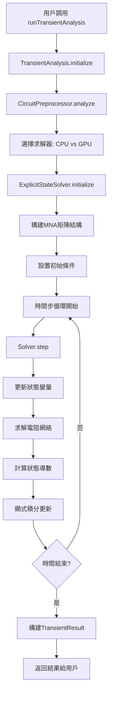

# AkingSPICE 項目架構與代碼組織

## 概述

AkingSPICE 是一個模塊化設計的JavaScript電路仿真器，採用現代ES6+語法和清晰的分層架構。本文檔詳細說明項目的代碼組織方式，幫助AI和開發者快速理解項目結構。

## 📁 目錄結構總覽

```
AkingSPICE/
├── 📁 src/                          # 核心源代碼
│   ├── 📄 index.js                  # 主入口文件 - 導出所有公共API
│   ├── 📁 core/                     # 核心計算引擎
│   │   ├── 📄 solver.js             # 主求解器 - 用戶主要接口
│   │   ├── 📄 explicit-state-solver.js # CPU顯式求解器 (791行)
│   │   ├── 📄 gpu-explicit-solver.js   # GPU顯式求解器 (625行)
│   │   ├── 📄 webgpu-solver.js      # WebGPU線性代數引擎
│   │   ├── 📄 circuit-preprocessor.js  # 電路預處理器
│   │   ├── 📄 mna.js                # 修正節點分析 (MNA) 構建器
│   │   └── 📄 linalg.js             # 線性代數工具 (矩陣/向量運算)
│   ├── 📁 components/               # 電路元件模型庫
│   │   ├── 📄 base.js               # 抽象基類 - 所有元件的父類
│   │   ├── 📄 resistor.js           # 電阻模型
│   │   ├── 📄 capacitor.js          # 電容模型  
│   │   ├── 📄 inductor.js           # 電感模型
│   │   ├── 📄 sources.js            # 信號源模型 (V,I,VCVS,VCCS等)
│   │   ├── 📄 diode.js              # 二極體模型
│   │   ├── 📄 mosfet.js             # MOSFET模型
│   │   ├── 📄 transformer.js        # 變壓器與耦合電感
│   │   └── 📄 threephase.js         # 三相電源系統
│   ├── 📁 analysis/                 # 分析引擎模組
│   │   ├── 📄 transient.js          # 暫態分析引擎
│   │   └── 📄 dc.js                 # 直流分析引擎
│   └── 📁 parser/                   # SPICE網表解析器
│       └── 📄 netlist.js            # 網表解析與語法分析
├── 📁 lib-dist/                     # 編譯輸出 (Rollup打包)
│   ├── 📄 AkingSPICE.es.js          # ES6模組格式 (推薦)
│   ├── 📄 AkingSPICE.umd.js         # UMD格式 (瀏覽器/Node.js通用)
│   └── 📄 *.map                     # Source Map文件
├── 📁 test/                         # 測試套件
│   ├── 📄 framework/TestFramework.js # 自製測試框架
│   ├── 📄 test-core-modules.js      # 核心模組測試
│   ├── 📄 test-solver-validation.js # 求解器驗證測試
│   ├── 📄 master-test.js            # 主測試運行器
│   └── 📄 test-*.js (54個文件)      # 各種功能測試
├── 📁 docs/                         # 文檔
│   ├── 📄 API_REFERENCE.md          # 完整API參考
│   ├── 📄 QUICK_REFERENCE.md        # 速查表與常用模式
│   ├── 📄 COMPONENT_GUIDE.md        # 元件使用指南
│   └── 📄 PROJECT_ARCHITECTURE.md   # 本文檔
├── 📁 tools/                        # 開發工具
│   └── 📄 ai-dev-helper.js          # AI開發助手
├── 📄 package.json                  # NPM配置與腳本
├── 📄 rollup.config.js              # 打包配置
└── 📄 *.html                        # 測試與調試頁面
```

---

## 🏗️ 架構分層設計

### 第1層: 用戶接口層 (User Interface Layer)

#### `src/index.js` - 主入口點
```javascript
// 統一導出所有公共API
export { AkingSPICE } from './core/solver.js';
export { NetlistParser } from './parser/netlist.js';

// 元件庫
export { BaseComponent } from './components/base.js';
export { Resistor, Capacitor, Inductor } from './components/...';

// 求解器 (高級用戶)
export { ExplicitStateSolver } from './core/explicit-state-solver.js';
export { GPUExplicitStateSolver } from './core/gpu-explicit-solver.js';

// 分析引擎 (高級用戶)
export { TransientAnalysis } from './analysis/transient.js';
export { DCAnalysis } from './analysis/dc.js';
```

**職責**: 提供清晰的公共API，隱藏內部實現細節

#### `src/core/solver.js` - AkingSPICE主類 (用戶主要接口)
```javascript
export class AkingSPICE {
    constructor(netlist = null)          // 可選網表初始化
    loadNetlist(netlistText)             // 載入SPICE網表
    runAnalysis(analysisCommand)         // 執行分析 (自動判斷類型)
    runDCAnalysis()                      // 直流分析  
    runTransientAnalysis(tranCommand)    // 暫態分析
    
    // 程式化電路建構
    get/set components                   // 元件陣列存取
    addComponent(component)              // 添加單個元件
    addComponents(componentArray)        // 添加元件陣列
    
    // 結果與狀態管理
    getResult(analysisType)              // 獲取分析結果
    getCircuitInfo()                     # 電路統計信息
    reset()                              // 重置求解器
}
```

**職責**: 
- 用戶的主要交互接口
- 集成網表解析、電路分析和結果管理
- 提供簡潔的API隱藏複雜度

### 第2層: 分析引擎層 (Analysis Engine Layer)

#### `src/analysis/transient.js` - 暫態分析
```javascript
export class TransientAnalysis {
    async initialize(components, timeStep, integrationMethod)
    async run(startTime, stopTime)      // 執行時域仿真
    setInitialConditions()              // 設置初始條件
}

export class TransientResult {
    timePoints: Float64Array            // 時間軸
    nodeVoltages: Map                   // 節點電壓歷史  
    componentCurrents: Map              // 元件電流歷史
    stateVariables: Map                 // 狀態變量歷史
    exportCSV()                         // 數據導出
}
```

#### `src/analysis/dc.js` - 直流分析
```javascript  
export class DCAnalysis {
    async run(components, options)      // 執行DC工作點分析
    estimateCondition(matrix)           // 矩陣條件數估算
}

export class DCResult {
    nodeVoltages: Map                   // 節點電壓
    componentCurrents: Map              // 元件電流
    convergenceInfo: Object             // 收斂信息
}
```

**職責**:
- 實現具體的分析算法 (DC、暫態)
- 管理分析結果和收斂狀態
- 提供標準化的結果格式

### 第3層: 求解器核心層 (Solver Core Layer)

#### `src/core/explicit-state-solver.js` - CPU顯式求解器 (791行)
```javascript
export class ExplicitStateSolver {
    constructor(options = {})
    async initialize(components, timeStep, options)
    async step(controlInputs)           // 執行單時間步
    async solveTimeStep(controlInputs)  // 別名方法
    
    // 內部算法實現
    updateStateVariables()              // 顯式狀態更新
    solveResistiveNetwork()             // 求解電阻網絡
    calculateStateDerivatives()         // 計算狀態導數
}
```

**核心算法流程**:
1. 將電容視為電壓源Vc(t)，電感視為電流源Il(t)  
2. 求解純電阻網絡 Gv = i
3. 計算狀態導數 dVc/dt, dIl/dt
4. 顯式積分更新: Vc(t+Δt), Il(t+Δt)

#### `src/core/gpu-explicit-solver.js` - GPU加速求解器 (625行)
```javascript
export class GPUExplicitStateSolver {
    constructor(options = {})
    async initialize(components, timeStep, options)
    async step(controlInputs)           // GPU並行時間步
    
    // GPU特有功能
    initializeWebGPU()                  // WebGPU初始化
    createComputeShaders()              // 創建計算著色器
    solveSmallCircuitFast()             // 小電路快速路徑
}
```

**性能優勢**:
- WebGPU並行計算，大電路4.6倍性能提升
- 自動回退CPU模式 (Node.js環境)
- 智能小電路檢測

#### `src/core/webgpu-solver.js` - WebGPU線性代數引擎
```javascript
export class WebGPUSolver {
    async initialize()                  // WebGPU設備初始化
    async solve(matrix, rhs)            // GPU矩陣求解
    createComputePipeline()             // 創建計算管線
    executeShader()                     // 執行WGSL著色器
}
```

### 第4層: 電路建模層 (Circuit Modeling Layer)

#### `src/components/base.js` - 抽象基類 (343行)
```javascript
export class BaseComponent {
    constructor(name, type, nodes, value, params)
    
    // 核心接口 (子類必須實現)
    stamp(mnaBuilder, frequency)        // MNA印記方法
    updateValue(newValue)               // 動態參數更新
    
    // 通用功能
    parseValue(value)                   // 工程記號解析 (1k→1000)
    getOperatingPoint()                 # 工作點信息
    clone()                             // 深拷貝創建
}
```

#### 具體元件實現
每個元件文件都遵循統一模式:
```javascript
// src/components/resistor.js
export class Resistor extends BaseComponent {
    constructor(name, nodes, resistance, params = {}) {
        super(name, 'R', nodes, resistance, params);
    }
    
    stamp(mnaBuilder, frequency = 0) {
        // 實現MNA矩陣印記
        const g = 1.0 / this.value;  // 導納
        mnaBuilder.addConductance(this.nodes[0], this.nodes[1], g);
    }
}
```

**元件庫清單**:
- **被動元件**: Resistor, Capacitor, Inductor, CoupledInductor
- **信號源**: VoltageSource, CurrentSource  
- **受控源**: VCVS, VCCS, CCVS, CCCS
- **半導體**: Diode, MOSFET
- **特殊**: MultiWindingTransformer, ThreePhaseSource

### 第5層: 基礎設施層 (Infrastructure Layer)

#### `src/core/mna.js` - 修正節點分析構建器
```javascript
export class MNABuilder {
    analyzeCircuit(components)          // 電路拓撲分析
    buildMNAMatrix(components, time)    // 構建MNA矩陣
    addConductance(n1, n2, g)           // 添加導納
    addCurrentSource(n1, n2, i)        // 添加電流源
    addVoltageSource(n1, n2, v)        // 添加電壓源 (增維)
}
```

#### `src/core/linalg.js` - 線性代數核心
```javascript
export class Matrix {
    constructor(rows, cols)
    get(i, j) / set(i, j, value)       // 矩陣元素訪問
    multiply(other)                     // 矩陣乘法
    transpose()                         // 轉置
}

export class LUSolver {
    static solve(A, b)                  // LU分解求解器
    static decompose(A)                 // LU分解
    static forwardSubst(L, b)           // 前向替代
    static backwardSubst(U, b)          // 後向替代
}
```

#### `src/core/circuit-preprocessor.js` - 電路預處理器
```javascript
export class CircuitPreprocessor {
    analyze(components)                 // 分析電路拓撲
    validateTopology()                  // 驗證電路合法性
    assignNodeIndices()                 // 分配節點索引
    detectFloatingNodes()               // 檢測懸浮節點
    optimizeNodeOrdering()              // 優化節點順序
}
```

#### `src/parser/netlist.js` - SPICE網表解析器
```javascript
export class NetlistParser {
    parse(netlistText)                  // 解析網表文本
    parseComponent(line)                // 解析元件行
    parseAnalysisCommand(line)          // 解析分析指令  
    parseModelStatement(line)           // 解析模型語句
    validateSyntax()                    // 語法驗證
}
```

---

## 🔄 數據流與執行流程

### 典型使用流程

#### 方式1: 網表驅動
```javascript
const spice = new AkingSPICE();
spice.loadNetlist(`
    V1 vin gnd DC(5)
    R1 vin vout 1k
    C1 vout gnd 1u IC=0
    .tran 1u 1m
`);
// 1. NetlistParser.parse() 解析文本
// 2. 創建對應的元件對象
// 3. 設置分析命令
const result = await spice.runAnalysis();
// 4. 根據分析類型調用對應引擎
// 5. 返回標準化結果對象
```

#### 方式2: 程式化構建  
```javascript
const spice = new AkingSPICE();
spice.components = [
    new VoltageSource('V1', ['vin', 'gnd'], 5),
    new Resistor('R1', ['vin', 'vout'], 1000),
    new Capacitor('C1', ['vout', 'gnd'], 1e-6, {ic: 0})
];
// 1. 直接設置元件陣列
// 2. 跳過網表解析步驟
const result = await spice.runTransientAnalysis('.tran 1u 1m');
// 3. 直接調用分析引擎
```

### 內部執行流程 (暫態分析)



### 求解器選擇邏輯
```javascript
// 自動選擇最佳求解器
function selectOptimalSolver(components, analysisType) {
    const nodeCount = getUniqueNodes(components).length;
    const hasWebGPU = checkWebGPUSupport();
    
    if (analysisType === 'transient' && nodeCount > 50 && hasWebGPU) {
        return new GPUExplicitStateSolver();  // 大電路 + 瀏覽器環境
    } else {
        return new ExplicitStateSolver();     // 小電路或Node.js環境
    }
}
```

---

## 🧪 測試架構

### 自製測試框架
```javascript
// test/framework/TestFramework.js - 模塊化測試系統
class TestFramework {
    registerTest(suiteName, testFunction)   // 註冊測試
    runTests()                              // 執行所有測試
    assert.equal(actual, expected)          // 斷言庫
    assert.approx(actual, expected, tol)    // 數值近似比較
}
```

### 專業測試套件
```javascript
// test/test-core-modules.js - 核心模組驗證 (10個測試)
- CPU求解器初始化測試
- GPU求解器可用性檢測  
- 電路元件庫測試
- 分析引擎功能測試
- 系統整合測試

// test/test-solver-validation.js - 求解器驗證 (7個測試)  
- CPU求解器數值穩定性
- GPU求解器性能基準
- CPU-GPU結果一致性
- 錯誤處理機制
```

### 測試執行腳本
```json
// package.json - NPM測試腳本
{
  "scripts": {
    "test:core": "node test/test-core-modules.js",
    "test:solvers": "node test/test-solver-validation.js", 
    "test:all": "node test/run-tests.js",
    "quality-gate": "npm run test:core && npm run test:solvers && npm run build"
  }
}
```

---

## 🔧 開發工具鏈

### 打包與建構 (Rollup)
```javascript
// rollup.config.js - 多格式輸出
export default [
    {
        input: 'src/index.js',
        output: {
            file: 'lib-dist/AkingSPICE.es.js',
            format: 'es',           // ES6模組 (推薦)
            sourcemap: true
        }
    },
    {
        input: 'src/index.js', 
        output: {
            file: 'lib-dist/AkingSPICE.umd.js',
            format: 'umd',          // 通用模組 (瀏覽器相容)
            name: 'AkingSPICE'
        }
    }
];
```

### AI開發助手
```bash
# tools/ai-dev-helper.js - 代碼生成與查詢工具
node tools/ai-dev-helper.js generate circuit rc     # 生成RC電路模板
node tools/ai-dev-helper.js api AkingSPICE          # 查詢API文檔  
node tools/ai-dev-helper.js example transient      # 搜索示例代碼
node tools/ai-dev-helper.js cheatsheet             # 顯示速查表
```

---

## 📊 性能與擴展性考量

### CPU vs GPU求解器對比

| 特性 | CPU ExplicitStateSolver | GPU GPUExplicitStateSolver |
|------|------------------------|---------------------------|
| **適用電路** | <50節點 | >50節點 |
| **環境支援** | Node.js + 瀏覽器 | 僅瀏覽器 (WebGPU) |
| **性能基準** | 基準1× | 4.6×提升 (大電路) |
| **記憶體使用** | 低 | 中等 (GPU緩衝區) |
| **數值精度** | Float64 | Float32 (WebGPU限制) |
| **初始化時間** | 快速 | 較慢 (WebGPU setup) |

### 可擴展性設計

#### 1. 插件式元件架構
```javascript  
// 添加自定義元件非常簡單
class CustomCapacitor extends BaseComponent {
    constructor(name, nodes, capacitance, temperatureCoeff) {
        super(name, 'C', nodes, capacitance);
        this.tempCoeff = temperatureCoeff;
    }
    
    stamp(mnaBuilder, frequency = 0) {
        // 考慮溫度係數的電容實現
        const adjustedC = this.value * (1 + this.tempCoeff * (this.temperature - 25));
        // ... MNA印記實現
    }
}
```

#### 2. 模塊化求解器架構
```javascript
// 可輕易添加新的求解器
class ImplicitSolver extends BaseSolver {
    async step() {
        // 實現隱式積分算法 (更穩定)
    }
}
```

#### 3. 可插拔分析引擎
```javascript
// 未來可添加頻域分析、諧波分析等
class ACAnalysis {
    async run(components, frequencies) {
        // 實現交流分析
    }
}
```

---

## 🎯 代碼質量與維護

### 編碼規範

#### 1. 命名約定
```javascript
// 類名: PascalCase
class ExplicitStateSolver { }

// 方法名: camelCase  
async runTransientAnalysis() { }

// 常數: UPPER_CASE
const MAX_ITERATIONS = 1000;

// 私有屬性: 前綴_
this._internalState = {};
```

#### 2. 錯誤處理模式
```javascript
// 使用自定義錯誤類型
class ConvergenceError extends Error {
    constructor(iteration, tolerance) {
        super(`Failed to converge after ${iteration} iterations (tol=${tolerance})`);
        this.name = 'ConvergenceError';
    }
}

// 統一的錯誤處理
try {
    const result = await solver.step();
} catch (error) {
    if (error.name === 'ConvergenceError') {
        // 特定錯誤處理
    }
    throw error; // 重新拋出未知錯誤
}
```

#### 3. 文檔化代碼
```javascript
/**
 * 執行單個時間步的電路仿真
 * @param {Object} controlInputs 控制輸入 (可選)
 * @param {number} controlInputs.timeStep 覆蓋時間步長
 * @param {Map<string, number>} controlInputs.sources 動態源值
 * @returns {Promise<Object>} 時間步結果
 * @throws {ConvergenceError} 當數值不收斂時
 * @example
 * const result = await solver.step({
 *     sources: new Map([['V1', 5.0]])
 * });
 */
async step(controlInputs = {}) { }
```

### 版本管理策略
- **主版本**: API破壞性變更
- **次版本**: 新功能添加 (向後兼容)  
- **修訂版本**: Bug修復

### 性能監控
```javascript
// 內建性能分析點
class PerformanceMonitor {
    startTimer(name) { }
    endTimer(name) { }
    getStats() { return this.timers; }
}

// 在關鍵路徑中使用
const perf = new PerformanceMonitor();
perf.startTimer('matrix_solve');
const solution = LUSolver.solve(matrix, rhs);
perf.endTimer('matrix_solve');
```

---

## 🚀 AI開發友好特性

### 1. 清晰的API分層
- **入門**: 僅需了解 `AkingSPICE` 類
- **進階**: 直接使用 `ExplicitStateSolver`  
- **專家**: 自定義元件和求解器

### 2. 豐富的示例庫
- 54個測試文件作為示例代碼
- 涵蓋從基本RC電路到複雜開關電源
- AI可直接參考和修改

### 3. 完整的文檔體系
- **API_REFERENCE.md**: 完整API文檔
- **QUICK_REFERENCE.md**: 速查表與常用模式  
- **COMPONENT_GUIDE.md**: 元件使用指南
- **PROJECT_ARCHITECTURE.md**: 本架構文檔

### 4. AI開發助手工具
```bash
# 一鍵生成代碼模板
node tools/ai-dev-helper.js generate circuit buck-converter
node tools/ai-dev-helper.js generate component custom-resistor

# 快速API查詢 (無需翻閱源代碼)
node tools/ai-dev-helper.js api ExplicitStateSolver step
```

### 5. 模塊化導入
```javascript
// AI可根據需要選擇性導入
import { AkingSPICE } from './lib-dist/AkingSPICE.es.js';                    // 僅主接口
import { Resistor, Capacitor } from './lib-dist/AkingSPICE.es.js';          // 僅元件
import { ExplicitStateSolver } from './lib-dist/AkingSPICE.es.js';           // 僅求解器
```

通過這種清晰的架構設計，AI和開發者可以快速定位所需功能，理解代碼組織邏輯，並高效地進行開發和維護工作。每個模組都有明確的職責邊界，降低了學習曲線和維護成本。